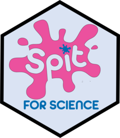

<!-- README.md is generated from README.Rmd. Please edit that file -->

```{r, include = FALSE}
knitr::opts_chunk$set(
  collapse = TRUE,
  comment = "#>",
  fig.path = "man/figures/README-"
)

```

# sfsScorer <a href="https://Schachar-Crosbie-Lab.github.io/sfsScorer/"></a>

<!-- badges: start -->

[](https://github.com/jclutton/sfsScorer/actions/workflows/R-CMD-check.yaml) [](https://app.codecov.io/gh/jclutton/sfsScorer) [](https://lifecycle.r-lib.org/articles/stages.html#experimental)

<!-- badges: end -->

Scoring tools for commonly used child and youth psychiatric questionnaires.

## Spit for Science

```{r, echo = FALSE, include=FALSE, out.width="40%"}
knitr::include_graphics('man/figures/Spit-for-Science-Infographic-2.jpg')
```

Spit for Science (SFS) was a large population-based study examining mental health in 40,000 children and youth. The study is one of the largest to have psychiatric trait and DNA data on a diverse group of children and youth. As such, it has been used to develop norms for the psychiatric questionnaires used in the study.

This package allows researchers to automatically score their psychiatric questionnaires using the SFS norms.

## Installation

The sfsScorer is still in development. You can install the development version of sfsScorer from [GitHub](https://github.com/) with:

``` r
# Install with pak
install.packages("pak")
pak::pak("jclutton/sfsScorer")

#OR 

# Install with devtools
# If the devtools package isn't installed already, do so first. 
install.packages("devtools")
devtools::install_github("jclutton/SwanScorer")
```

## Scoring Tools

Click on the questionnaire link for instructions.

-   [The Strengths and Weaknesses of ADHD Symptoms and Normal Behavior Rating Scale (SWAN)](https://schachar-crosbie-lab.github.io/sfsScorer/articles/score_a_swan_questionnaire.html)

-   [Toronto Obsessive-Compulsive Scale 2 (TOCS-2)](https://schachar-crosbie-lab.github.io/sfsScorer/articles/score_a_tocs_questionnaire.html)
